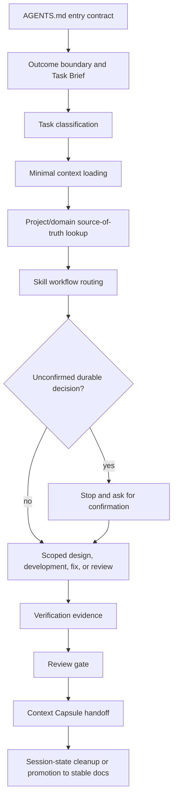

# Agent Feed

[](LICENSE)
[](docs/ai-development-protocol-flow.md)
[](docs/open-source-readiness.md)

Agent Feed installs reusable AI development docs, `AGENTS.md` instructions, `.agents/` rules, AI coding workflows, and client adapters into software projects.

It is not an AI coding agent and not a spec-generation framework. It gives Codex, Claude Code, Cursor, and similar tools a shared guidance layer so AI-assisted development starts from the right context, stays inside the current result boundary, stops before unconfirmed decisions, verifies claims, and leaves a usable handoff.

## Why It Exists

AI-assisted development gets unreliable when project guidance only lives in chat, scattered docs, or tool-specific instruction files. Common failure modes:

1. The assistant loses the current goal after context compression.
2. A small task expands into broad redesign.
3. Missing product or architecture decisions are silently invented.
4. Different AI clients read different instruction files and behave differently.
5. Project-specific constraints get mixed into reusable prompts.
6. Code changes are reported as complete without verification evidence.
7. Important conclusions from long-running work never become durable project knowledge.

Agent Feed turns those problems into a small, repeatable development protocol.

## At A Glance

| Need | Agent Feed gives you |
| --- | --- |
| Multiple AI coding tools behave inconsistently | One canonical `AGENTS.md` + `.agents/` source and generated adapters for Claude Code and Cursor |
| AI drifts out of scope or invents missing decisions | Outcome boundary, decision gates, and task routing rules |
| AI work is hard to verify | Generated verification entrypoints and review gates |
| Context compression loses important conclusions | Session-state handoff rules |
| Imported/custom skills feel unsafe | Skill index, trust metadata, external hash tracking, and stop-before-use checks |

## Getting Started

```sh
agent-feed env setup
agent-feed init --interactive
agent-feed check
agent-feed status
```

For a concrete walkthrough of the AI protocol itself, start with [AI Development Protocol Flow](docs/ai-development-protocol-flow.md).

## Scope

Agent Feed sits in the AI software engineering and agentic development tooling space.

It focuses on the workflow layer around AI coding agents: project instructions, engineering guardrails, context recovery, decision gates, verification gates, review gates, and client adapter synchronization.

It does not replace AI application frameworks, LLMOps platforms, SDKs, or model deployment tools. Those tools help build AI applications. Agent Feed helps teams use AI coding agents more reliably while building any software project.

## Use Cases

Use Agent Feed when you need:

1. An `AGENTS.md` template for AI coding agents.
2. Shared project instructions for Codex, Claude Code, Cursor, and other coding agents.
3. AI coding guardrails that reduce scope drift, invented decisions, and unverified code changes.
4. A reusable `.agents/` rules and skills structure for AI-assisted software development.
5. Context compression recovery through compact session-state handoff files.
6. Verification gates for AI-generated code, documentation changes, and project rule changes.
7. Project-specific AI development constraints without mixing them into generic prompt files.

## How It Works

The installed project shape is:

1. `AGENTS.md` as the canonical repository entry contract.
2. `.agents/rules/` for reusable development gates.
3. `.agents/project/` for user-maintained project-specific constraints.
4. `.agents/domain/` for stable project knowledge and contract ownership.
5. `.agents/session-state/` for compact long-running conversation handoff.
6. `.agents/skills/` for task-specific AI workflows.
7. `.agents/scripts/` for sync and verification helpers.
8. Generated client adapters for Claude Code and Cursor.

The macro flow is:



The detailed flow is documented in [AI Development Protocol Flow](docs/ai-development-protocol-flow.md).

See [Basic Generated Output](examples/basic-output.md) for the directory layout created by `agent-feed init`.

## What It Gives A Project

| Layer | Purpose |
| --- | --- |
| `AGENTS.md` | Shared entrypoint, rule priority, mandatory gates, and responsibility boundaries. |
| `.agents/rules/outcome-boundary.md` | Defines the current task result, stopping condition, Task Brief, and anti-drift rules. |
| `.agents/rules/decision-gates.md` | Forces human confirmation before AI turns ambiguous choices into durable contracts. |
| `.agents/rules/context-loading.md` | Loads the smallest useful context instead of flooding or guessing. |
| `.agents/rules/session-state.md` | Preserves only active handoff facts that could be lost after context compression. |
| `.agents/rules/testing-gates.md` | Ties verification evidence to the actual task boundary. |
| `.agents/project/` | Keeps repository-specific constraints separate from reusable AI workflow rules. |
| `.agents/domain/` | Keeps stable project concepts, contracts, and source-of-truth ownership recoverable. |
| `.agents/skills/` | Routes architecture, development, fix, review, design review, guidance promotion, and skill maintenance work. |
| `.agents/scripts/` | Checks structure, links, skills, session-state JSON, and generated adapters. |

## Install

After release:

```sh
uv tool install agent-feed
# or
pipx install agent-feed
```

Before release, run it from this checkout:

```sh
uv run agent-feed
```

## Quick Start

```sh
cd /path/to/project
agent-feed env setup
agent-feed init --interactive
agent-feed check
agent-feed status
agent-feed preview
```

All path arguments are optional. When omitted, commands operate on the current directory.

## CLI Experience

Agent Feed follows a few mature CLI conventions:

1. `agent-feed` opens an interactive menu in a TTY, but prints help in non-interactive shells.
2. `-h` / `--help` stay focused on the primary commands instead of low-value shell-completion plumbing.
3. `status` shows the compact Changes table; press `v` in an interactive terminal to open the full diff view.
4. `preview` prints full red/green diffs directly for installed projects; `upgrade --dry-run` keeps the compact preview flow.
5. Non-interactive write operations stay deterministic. Use explicit flags such as `-y`, `--clients`, and `--profile` instead of relying on prompts.
6. Commands print the next obvious action whenever a write, preview, or validation step completes.

## Commands

```sh
agent-feed
agent-feed --version
agent-feed init [path] [--project-name NAME] [--clients codex,claude,cursor|all|none] [--profile python|node|custom|none]
agent-feed upgrade [path] [--clients codex,claude,cursor|all|none] [--dry-run] [--diff]
agent-feed sync [path] [--clients codex,claude,cursor|all|none]
agent-feed check [path] [-a|--all] [--checks structure,skills,references,session,scripts,codex,claude,cursor|all]
agent-feed status [path] [--json]
agent-feed preview [path] [--clients codex,claude,cursor|all|none] [--profile python|node|custom|none]
agent-feed config get [KEY] [--path PATH] [--json]
agent-feed config set KEY VALUE [--path PATH] [--dry-run]
agent-feed index-skills [path] [-y] [--dry-run]
agent-feed skill-hub [path] [--keyword KEYWORD] [--dry-run]
agent-feed env status [path]
agent-feed env setup [path] [--home PATH] [--shell auto|zsh|bash|fish|powershell] [--force] [--dry-run]
agent-feed env print [--home PATH] [--shell auto|zsh|bash|fish|powershell]
agent-feed env uninstall [--home PATH] [--shell auto|zsh|bash|fish|powershell] [--remove-home] [--dry-run] [-y]
agent-feed uninstall [path] [--dry-run] [-y]
```

`agent-feed --version` prints both the executable path and imported package path. Use it when a globally installed command appears stale compared with the current checkout.

In an interactive terminal, `agent-feed` without arguments is the fastest entrypoint. For scripting, call the concrete command directly.

## Client Adapters

Agent Feed keeps `AGENTS.md` and `.agents/` canonical.

| Client | Generated adapter | Behavior |
| --- | --- | --- |
| Codex | none | Codex uses `AGENTS.md` and `.agents/skills` directly. |
| Claude Code | `CLAUDE.md`, `.claude/skills/` | `CLAUDE.md` must include `@AGENTS.md`, `.claude/skills`, and `.agents/`; skills mirror `.agents/skills`. |
| Cursor | `.cursor/rules/agent-feed.mdc` | Always rule points Cursor to `AGENTS.md` and `.agents/`. |

`--project-name` is a display name inserted into generated templates, mainly the `AGENTS.md` heading. It does not need to match the Python package name, Git repository name, or folder name. When omitted, Agent Feed uses the target folder name.

During `init`, `--profile` selects the project code gate stored in `.agents/agent-feed.json`. After initialization, change it with `agent-feed config set verification_profile <profile>`:

| Profile | Intended project | Code verification |
| --- | --- | --- |
| `python` | Python projects | Prefers `uv`, falls back to `python3`, then `python`; runs `pytest`, plus `ruff`/`mypy` when installed. |
| `node` | Node projects | Prefers `pnpm`, falls back to `npm`; runs `test`, plus `lint`/`typecheck`/`build` scripts when present. |
| `custom` | Any project with custom commands | Uses `.agents/project/verification-commands.sh` as the user-maintained hook for real project commands. |
| `none` | AI docs/assets only repositories | No code gate configured. |

### Custom Verification

If your project uses custom test, lint, type-check, build, or smoke-test commands:

1. Initialize with `--profile custom`.
2. Edit `.agents/project/verification-commands.sh`.
3. Replace `run_project_code_checks()` with the repository's real commands.
4. Keep `.agents/scripts/verify-agent-dev.sh` unchanged as the generated entrypoint.

This keeps upgrades safe: Agent Feed can refresh the generic verifier while leaving project-owned commands in the project layer.

## Project Settings

Project-visible Agent Feed settings live in `.agents/agent-feed.json` under `settings`.

Current supported settings:

1. `settings.session_state.max_carry_forwards`: controls the generated session-state schema limit and the `check --checks session` validation limit.
2. `settings.skills.default_import_source`: default `source` filled into imported or manually added skills when the field is missing.
3. `settings.skills.default_import_trust`: default trust for imported/manual skills when the field is missing. Supported values are `custom` and `reviewed`.
4. `settings.claude.required_snippets`: required substrings that must appear in a user-maintained `CLAUDE.md`.

Use `config set` to update a setting and refresh derived assets in one step:

```sh
agent-feed config get verification_profile
agent-feed config set verification_profile custom
agent-feed config set settings.session_state.max_carry_forwards 5
```

`config set` writes `.agents/agent-feed.json`, refreshes settings-driven managed assets, reindexes skills with the configured defaults, syncs configured client adapters, and updates the external trust state. User-level or secret values such as GitHub tokens stay outside the repository in `$AGENT_FEED_HOME/config.json`.

## Curated Skill Hub

Agent Feed can browse and import skills from a curated public allowlist.

Current hubs:

1. OpenAI Skills: [openai/skills](https://github.com/openai/skills)
2. Anthropic Skills: [anthropics/skills](https://github.com/anthropics/skills)
3. Trail of Bits Skills: [trailofbits/skills](https://github.com/trailofbits/skills)

Use:

```sh
agent-feed skill-hub --keyword review
```

Interactive flow:

1. Search curated hubs by keyword.
2. Browse matching skills in the terminal.
3. `Space` selects multiple skills.
4. `v` previews the current skill's source, target file tree, and install boundary.
5. `Enter` installs the selected skills.
6. `Esc` returns to the previous step.

Imported skills are installed as `trust: custom`, no remote scripts are executed during install, and Agent Feed automatically runs the equivalent of `index-skills` after import.

`skill-hub` uses the GitHub API for the curated allowlist. It first tries anonymous access. If GitHub rejects or rate-limits the request in an interactive terminal, Agent Feed asks for a token and can save it to the user-level `~/.agent-feed/config.json` as `settings.github_token`. `GITHUB_TOKEN` still works and takes precedence over the saved config value.

## Trust State

Agent Feed requires `AGENT_FEED_HOME` for AI asset trust checks. Accepted hashes for built-in, reviewed, or local AI assets are stored in `$AGENT_FEED_HOME/config.json`, outside the target repository. The project-visible `.agents/agent-feed.json` keeps template metadata only.

```sh
agent-feed env setup
agent-feed index-skills -y
```

By default, Agent Feed stores trust state in a user-level home:

1. macOS/Linux: `~/.agent-feed`
2. Windows: `%APPDATA%\agent-feed`

`agent-feed env setup` writes a managed block to the detected shell config on macOS/Linux, or sets the user environment variable on Windows PowerShell. It also creates the external `config.json` store in that user-level home. If `AGENT_FEED_HOME` already points somewhere else, Agent Feed stops and asks you to pass `--force` before replacing it. Use `agent-feed env print` when you only want the shell command, `agent-feed env status` to diagnose the current configuration, and `agent-feed env uninstall --remove-home -y` to remove the environment binding and the user-level Agent Feed home.

In an interactive terminal, `agent-feed env setup` will ask before replacing a
different existing `AGENT_FEED_HOME` value. Pass `--force` to skip that prompt.

Manual setup still works:

```sh
export AGENT_FEED_HOME="$HOME/.agent-feed"
```

`status`, `preview`, and `check` read the current files and compare them with the external trust state. If a trusted skill or managed script changes, Agent Feed reports the concrete `.agents/skills/*/SKILL.md` or `.agents/scripts/*` path. Review the diff first, then accept intentional changes with `agent-feed index-skills -y`.

## Safety Model

`init` intentionally fails when the target already contains `AGENTS.md` or non-empty `.agents`. It also refuses to overwrite unsafe selected client adapters. For Claude, an existing `CLAUDE.md` is accepted when it contains the required Agent Feed references (`@AGENTS.md`, `.claude/skills`, and `.agents/`); otherwise it is blocked instead of rewritten. Cursor remains marker-managed because it is a generated rule file.

`status` shows the compact installed-project Changes table. In an interactive terminal, press `v` from `status` to open the full diff view.

`preview` shows the init write plan for projects that do not yet have Agent Feed installed. When the target already has `AGENTS.md` and `.agents/`, it switches to upgrade mode and prints full red/green diffs directly. By default it only includes currently configured client adapters for installed projects; pass `--clients all` to preview additional adapters.

`upgrade` refreshes installed Agent Feed docs/assets from the bundled template without deleting local files. It updates managed reusable assets, creates missing template files, and ignores existing user-maintained `.agents/project/` and `.agents/domain/` files so local project guidance does not create noisy template diffs.

`config set` is narrower than `upgrade`: it updates one project-visible config value and immediately reapplies the settings-driven managed output derived from `.agents/agent-feed.json`.

`sync` regenerates selected client adapters from canonical assets. For Claude, it keeps a user-maintained `CLAUDE.md` when the required references are present and syncs `.claude/skills`. Use `--force-generated` only for generated files that are safe to refresh.

`uninstall` removes only files Agent Feed can identify as managed or generated. It also removes the current project's entry from the external `$AGENT_FEED_HOME/config.json` trust state. It prints the removal plan first, skips unmanaged user files, and requires `-y` in non-interactive shells.

When initialized project/domain docs are still scaffold-like, generated rules now require the AI to infer concrete project/domain guidance from the repository's existing docs and code before continuing project-specific work. The AI should replace scaffold-only sections with repository-backed facts, keep uncertain assumptions explicit, and ask the user only when the missing decision could affect future development results. After that initialization, feature or architecture changes should trigger a review of related project/domain files so they stay aligned with the repository.

```sh
agent-feed uninstall . --dry-run
agent-feed uninstall . -y
```

## Team And Git Workflow

Agent Feed is designed for team development, not just solo local usage.

Recommended review loop:

1. Use `git status --short` to confirm the change set.
2. Review with `git diff` before claiming the task is done.
3. Run the verification gate that matches the task boundary.
4. For AI protocol or skill changes, run `sh .agents/scripts/verify-agent-dev.sh docs`.
5. Keep commit messages short and imperative, for example `feat: add env setup flow` or `docs: clarify custom verification`.

The protocol-layer git rules are documented in `.agents/rules/git-collaboration.md` and are generated into initialized projects.

## Documentation Map

Start here based on what you need:

1. [AI Development Protocol Flow](docs/ai-development-protocol-flow.md): the end-to-end AI governance loop, trigger points, file responsibilities, and pain points solved.
2. [Template Model](docs/template-model.md): canonical template structure, adapter boundaries, skill index model, and trust-state ownership.
3. [CLI Product Plan](docs/cli-product-plan.md): command boundary, UX decisions, and implementation-facing product notes.
4. [Product Design](docs/product-design.md): product goal, target users, MVP contract, and current gap framing.
5. [Open Source Readiness](docs/open-source-readiness.md): release-readiness checklist and public repo gaps.

## Current State

This is a working prototype:

1. The CLI can initialize a target project with AI development docs/assets.
2. It can generate Claude and Cursor adapters.
3. It can validate required files, structure, `.agents` references, session-state JSON shape, skill names, scripts, and selected client adapters.
4. It supports interactive init, check, sync, and upgrade selection.
5. It refuses unsafe initialization over existing `AGENTS.md`, `.agents`, or unmanaged selected client adapters.
6. It can generate Python, Node, custom, or docs-only verification profiles.
7. It can preview and apply non-destructive upgrades for installed AI development docs/assets.
8. It includes GitHub CI, issue templates, pull request template, contribution guide, and security policy for the initial open-source repository.

Not yet mature:

1. Brownfield migration/adoption for projects that already have AI instruction assets.
2. Monorepo verification profiles.
3. Release packaging workflow and published documentation site.
