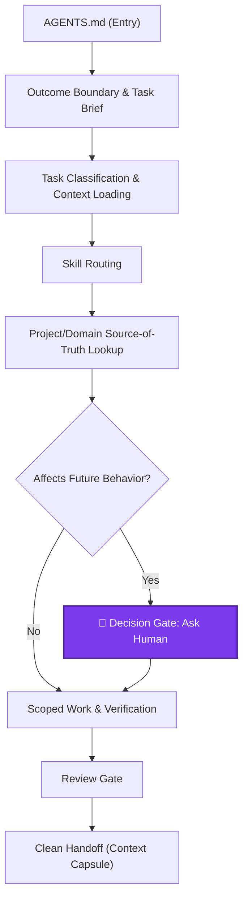

# Agent Feed

**Stop AI coding from drifting.**
**Turn scattered instructions into a reliable, repository-owned workflow pipeline.**

[](LICENSE)
[](docs/ai-development-protocol-flow.md)
[](docs/template-model.md)

> Your AI coding assistant is not broken. It is usually missing a shared workflow.

Agent Feed installs `AGENTS.md` plus a standardized `.agents/` protocol into your repository, giving Codex, Claude Code, Cursor, verification, review, and handoff one unified source of truth. Teams can then extend that foundation without changing the core protocol by layering in project-specific constraints, domain knowledge, and imported skills from `skill-hub`.

No more drifting conversations, scope creep, invented architecture decisions, or lost context after compression.

## 💡  Why You'll Feel The Difference

Agent Feed turns the recurring failure modes of AI coding into visible advantages:

- **Focused context**: the assistant loads the rules, project constraints, domain docs, and skills needed for the current task instead of flooding the prompt or guessing from stale chat.
- **Scope control**: outcome boundaries and Task Briefs keep a small request from turning into an unsolicited redesign.
- **Decision safety**: architecture, contract, verification, and source-of-truth choices stop at a human confirmation gate instead of becoming accidental code.
- **Evidence-backed completion**: "done" is tied to the verification profile, docs checks, review gates, and the actual task boundary.
- **Clean handoff**: Context Capsules and session-state rules preserve only result-affecting conclusions, so long sessions can resume without replaying the whole conversation.
- **Flexible customization**: keep the core workflow standardized, then layer in project-specific constraints and imported skills for your language, stack, review style, or team habits.

## 🎯 Problems It Solves

| Pain point | Without Agent Feed | With Agent Feed |
| --- | --- | --- |
| Inconsistent behavior across AI tools | Rules live in chat, `CLAUDE.md`, Cursor rules, and scattered docs. | One canonical `AGENTS.md` plus thin adapters. |
| Small tasks become redesigns | The assistant keeps expanding scope. | Outcome boundaries, Task Briefs, and task routing. |
| Important decisions are invented silently | Architecture, contracts, or verification choices appear from chat. | Decision gates require human confirmation. |
| "Done" has weak evidence | Tests, docs checks, or review are skipped. | Verification and review gates are part of the loop. |
| Long sessions lose direction | Context compression drops active conclusions. | Session-state handoff and Context Capsule rules. |
| Skills or scripts drift unexpectedly | Trusted AI assets can change without a clear checkpoint. | External trust hashes and stop-before-use checks. |
| Teams need their own methods | Generic prompts do not capture project-specific review or implementation habits. | Project/domain layers plus `skill-hub` imports extend the protocol without replacing the core workflow. |

In short: Agent Feed turns chaotic AI-assisted coding into a repeatable, controllable, and team-friendly engineering process.

## 🚀 Quick Start

Install Agent Feed:

```sh
uv tool install agent-feed
# or
pipx install agent-feed
```

Initialize a project:

```sh
agent-feed init      # install the protocol into the current project
agent-feed check     # validate structure, references, scripts, skills, and adapters
agent-feed status    # see current state and the next recommended action
```

For local development from this checkout:

```sh
uv run agent-feed
```

## ⚙️ How It Works

The core workflow enforces a strict, linear pipeline instead of an open-ended chat:



The protocol is intentionally split by responsibility while remaining customizable:

| Layer | Responsibility |
| --- | --- |
| `AGENTS.md` | Repository entry contract, priority order, mandatory gates, and routing. |
| `.agents/rules/` | Reusable workflow constraints for boundary, context, testing, review, git, and handoff. |
| `.agents/project/` | User-maintained repository constraints such as architecture, layout, milestones, and verification commands. |
| `.agents/domain/` | Stable project knowledge: concepts, contracts, and source-of-truth ownership. |
| `.agents/skills/` | Task workflows for architecture, implementation, fixes, reviews, and imported/custom methods. |
| `.agents/session-state/` | Compact handoff state for context compression, not a transcript or product memory. |
| `.agents/scripts/` | Protocol checks, skill indexing, adapter sync, trust checks, and verification entrypoints. |
| Client adapters | `CLAUDE.md`, `.claude/skills/`, and `.cursor/rules/agent-feed.mdc` point tools back to the canonical protocol. |


**The Bottom Line:**
Agent Feed adds workflow governance without becoming a heavy runtime service. It is **tool-neutral** (Codex, Claude Code, Cursor), **safe and auditable** (external hash storage), and **extensible without forking** (import skills via `skill-hub`). Reusable protocol rules stay strictly separated from your project-specific constraints.

## 🌍 Ecosystem Fit

Agent Feed sits beside the AI coding tools and rule formats developers already use.

| Tool or format | How Agent Feed relates |
| --- | --- |
| [`AGENTS.md`](https://agents.md/) | Uses `AGENTS.md` as the canonical entrypoint, then adds rules, skills, checks, adapters, and handoff around it. |
| Codex | Uses `AGENTS.md` and `.agents/skills/` directly. |
| Claude Code | Gets a thin `CLAUDE.md` adapter and a `.claude/skills/` mirror. |
| Cursor | Gets a thin always-on rule that imports `@AGENTS.md`. |
| Continue and other AI tooling | Can coexist with Agent Feed as the repository-owned workflow layer around local AI-assisted development. |

## 💻 Common Commands

```sh
agent-feed                 # interactive menu in a TTY
agent-feed init            # initialize the current project
agent-feed status          # compact health and drift summary
agent-feed check -a        # run every protocol and adapter check
agent-feed sync -a         # update all supported client adapters
agent-feed index-skills    # regenerate the skill index after local or imported skill changes
agent-feed skill-hub       # browse and import curated public skills for team-specific workflows
agent-feed config check    # validate project and user-level config
agent-feed --help          # full CLI reference
```

All path arguments are optional. When omitted, commands operate on the current directory.

## 📚 Documentation

- **[AI Development Protocol Flow](docs/ai-development-protocol-flow.md)**: the full governance loop, trigger points, file responsibilities, and pain points solved.
- **[Template Model](docs/template-model.md)**: canonical structure, adapters, skill index, project settings, and trust-state ownership.
- [Basic Generated Output](examples/basic-output.md): the directory layout created by `agent-feed init`.
- [Live Protocol Example](examples/live-protocol/README.md): the real `AGENTS.md`, `CLAUDE.md`, `.agents/project/`, `.agents/domain/`, and skill index used to develop this repository.

## 📂 Repository Tour

```txt
src/agent_feed/              CLI, checks, prompts, adapters, trust, and settings logic
src/agent_feed/templates/    canonical generated protocol template
docs/                        public protocol and template docs
examples/                    generated output and live protocol examples
tests/                       CLI behavior and protocol regression coverage
.agents/                     development protocol for this repository itself
```
