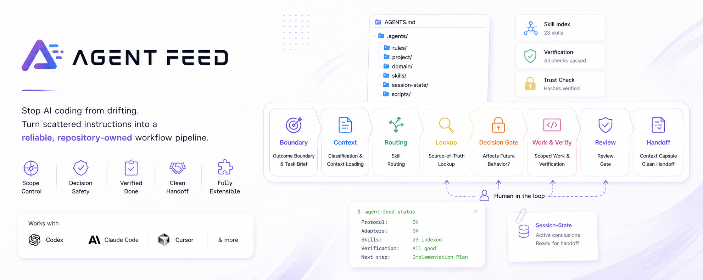
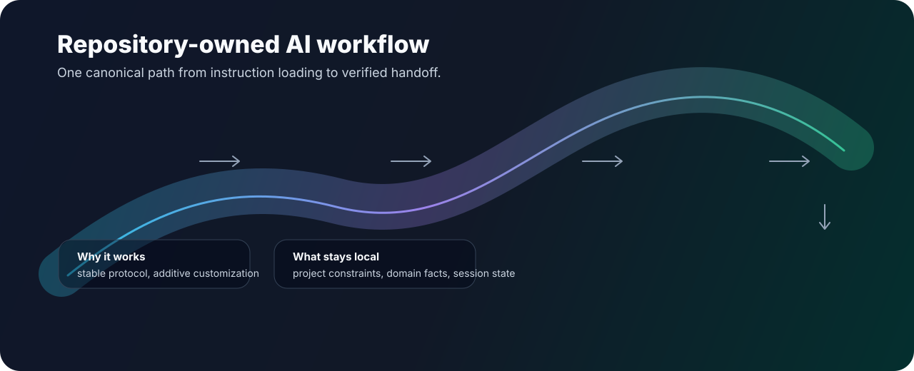
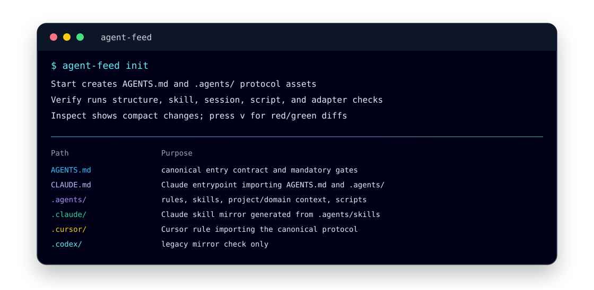

<p align="center">
  <a href="README.md">English</a>
</p>

<p align="center">
  
</p>

<h1 align="center">Agent Feed</h1>

<h3 align="center">面向 AI 编程 Agent 的仓库级工作流治理层。</h3>

<p align="center">
  <strong>让 AI 编程不再跑偏。</strong><br>
  将零散提示词指令转化为面向 Codex、Claude Code、Cursor、验证、审查和交接的可靠工作流管道。
</p>

<p align="center">
  <a href="LICENSE"></a>
  <a href="pyproject.toml"></a>
  <a href="AGENTS.md"></a>
  <a href="docs/ai-development-protocol-flow.md"></a>
  <a href="docs/template-model.md"></a>
</p>

<p align="center">
  <a href="#-为什么你会感受到前所未有的不同">为什么</a> ·
  <a href="#-解决的核心痛点">痛点</a> ·
  <a href="#-快速开始">快速开始</a> ·
  <a href="#️-工作原理">工作原理</a> ·
  <a href="#-常用命令">命令</a> ·
  <a href="#-文档导航">文档</a>
</p>

---

> 你的 AI 编程助手并没有坏，它只是缺少一个统一的工作流。

Agent Feed 会在你的代码仓库中安装 `AGENTS.md` 以及标准化的 `.agents/` 协议，为 Codex、Claude Code、Cursor、代码验证、代码审查以及会话交接提供**唯一事实来源 (Single Source of Truth)**。团队可以在此基础之上，叠加项目特定的约束、领域知识，或通过 `skill-hub` 导入外部技能，而无需修改核心协议。

告别跑偏的对话、失控的需求膨胀、凭空捏造的架构决策，以及长对话压缩后丢失的核心上下文。

## 💡 为什么你会感受到前所未有的不同

Agent Feed 将 AI 编程中常见的“翻车场景”转化为了切实可见的优势：

- **精准的上下文**：AI 助手只会加载当前任务所需的规则、项目约束、领域文档和技能，而不是将毫无关联的信息塞满 Prompt 或从过期的聊天记录中瞎猜。
- **范围控制 (告别需求膨胀)**：通过“结果边界 (Outcome Boundaries)”和“任务简报 (Task Briefs)”，确保小需求不会演变成自作主张的全局重构。
- **决策安全**：遇到架构、代码契约、测试验证及核心事实的变更时，AI 会在“人类确认节点 (Decision Gate)”停下询问，而不是盲目生成意外的代码。
- **拿证据说话的“已完成”**：“完成”不再是 AI 的一句话，它与验证配置文件（测试、文档检查）、审查节点以及实际的任务边界严格绑定。
- **无缝的会话交接**：“上下文胶囊 (Context Capsules)”和会话状态规则只保留对结果有影响的核心结论。即使长会话被压缩，新开对话也能无缝衔接，无需从头回顾。
- **灵活的定制能力**：保持核心工作流的标准化，同时允许你为特定的语言、技术栈、审查风格或团队习惯叠加项目专属约束或导入外部技能。

## 🎯 解决的核心痛点

| 核心痛点 | 没有 Agent Feed 时 | 使用 Agent Feed 后 |
| --- | --- | --- |
| **不同的 AI 工具表现不一致** | 规则散落在聊天记录、`CLAUDE.md`、Cursor rules 和各种文档中。 | 提供统一的规范源 `AGENTS.md` 及轻量级适配器。 |
| **小任务膨胀成大重构** | AI 助手不断自行扩大修改范围。 | 明确结果边界、任务简报和任务路由机制。 |
| **核心决策被悄悄捏造** | AI 在聊天中凭空编造架构、契约或测试选择。 | 引入“决策节点”，强制要求人类介入确认。 |
| **“做完了”缺乏证据** | AI 经常跳过测试、文档检查或代码审查。 | 将代码验证和审查节点内建到工作流循环中。 |
| **长会话迷失方向** | 上下文压缩导致之前确认的结论丢失。 | 引入会话状态交接和“上下文胶囊”。 |
| **技能或脚本意外偏移** | 被信任的 AI 资产在不知情的情况下被篡改。 | 外部信任哈希存储和“使用前检查”。 |
| **团队需要专属的开发习惯** | 通用的 Prompt 无法覆盖项目特有的审查或实现习惯。 | 提供项目/领域层，并可通过 `skill-hub` 导入技能，在不替换核心工作流的前提下进行扩展。 |

简而言之：Agent Feed 将混乱的 AI 辅助编程，转化为了可重复、可控且对团队友好的工程流程。

## 🚀 快速开始

安装 Agent Feed:

```sh
uv tool install agent-feed
# 或使用
pipx install agent-feed
```

在你的项目中初始化:

```sh
agent-feed init      # 在当前项目中安装标准协议
agent-feed check     # 验证目录结构、引用、脚本、技能以及适配器
agent-feed status    # 查看当前状态及下一步推荐操作
```

从源码本地开发运行:

```sh
uv run agent-feed
```

## ⚙️ 工作原理

### 指令进入，带证据交接。

核心工作流强制执行严格的线性管道，而非开放式的闲聊：



该协议在保持高度可定制性的同时，在职责上进行了明确的拆分：

| 层级 | 职责说明 |
| --- | --- |
| **`AGENTS.md`** | 仓库入口契约、优先级顺序、强制节点与路由。 |
| **`.agents/rules/`** | 可复用的工作流约束（边界、上下文、测试、审查、Git协作及交接）。 |
| **`.agents/project/`** | 用户维护的仓库专属约束（架构、目录结构、里程碑及验证命令）。 |
| **`.agents/domain/`** | 稳定的项目知识（核心概念、契约及事实来源的归属）。 |
| **`.agents/skills/`** | 针对架构、实现、修复、审查及导入/自定义方法的任务流。 |
| **`.agents/session-state/`** | 应对上下文压缩的精简交接状态（非完整对话或产品记忆）。 |
| **`.agents/scripts/`** | 协议检查、技能索引、适配器同步、信任检查及验证入口脚本。 |
| **客户端适配器** | `CLAUDE.md`、`.claude/skills/` 和 `.cursor/rules/agent-feed.mdc`，将具体工具引导回标准化协议。 |



**核心要义：**
Agent Feed 增加了工作流治理能力，但不会变成繁重的运行时服务。它**工具中立**（支持 Codex、Claude Code、Cursor），**安全可审计**（外部哈希存储机制），并且**无需 Fork 即可扩展**（通过 `skill-hub` 导入外部技能）。你的可复用协议规则与项目特定的约束将被严格分离。

## 🌍 生态定位

Agent Feed 与开发者已在使用的 AI 编程工具和规则格式完美并存：

| 工具或格式 | Agent Feed 如何与之协作 |
| --- | --- |
| **[`AGENTS.md`](https://agents.md/)** | 将其作为标准入口点，并在其周围增加规则、技能、检查、适配器和交接逻辑。 |
| **Codex** | 直接读取使用 `AGENTS.md` 和 `.agents/skills/`。 |
| **Claude Code** | 自动生成轻量级的 `CLAUDE.md` 适配器以及 `.claude/skills/` 镜像目录。 |
| **Cursor** | 自动生成一条轻量级的、全局生效的规则并引入 `@AGENTS.md`。 |
| **Continue 及其他工具** | 完美共存，Agent Feed 专注于 PR（拉取请求）提交前，本地 AI 辅助开发的“仓库级工作流治理”。 |

## 💻 常用命令

```sh
agent-feed                 # 在终端中打开交互式菜单
agent-feed init            # 初始化当前项目
agent-feed status          # 查看精简的健康度与偏移状态摘要
agent-feed check -a        # 运行所有的协议及适配器检查
agent-feed sync -a         # 更新所有支持的客户端适配器
agent-feed index-skills    # 在修改/导入技能后，重新生成技能索引
agent-feed skill-hub       # 浏览并导入官方精选的公共技能，打造团队专属工作流
agent-feed config check    # 校验项目级与用户级的配置
agent-feed --help          # 查看完整的 CLI 命令帮助
```
*(所有路径参数均可省略。省略时，默认在当前目录下执行。)*

## 📚 文档导航

- **[AI Development Protocol Flow (协议工作流解析)](docs/ai-development-protocol-flow.md)**：端到端的 AI 治理循环、触发点、文件职责以及解决的痛点。
- **[Template Model (模板模型)](docs/template-model.md)**：标准目录结构、适配器边界、技能索引、项目设置以及信任状态归属。
- [Basic Generated Output (基础生成示例)](examples/basic-output.md)：`agent-feed init` 初始化的目录结构示例。
- [Live Protocol Example (真实协议示例)](examples/live-protocol/README.md)：开发本仓库时实际使用的 `AGENTS.md`、`CLAUDE.md`、项目规则及技能索引。

## 📂 仓库导览

```txt
src/agent_feed/              # CLI 工具、检查器、提示词、适配器、信任机制及设置逻辑
src/agent_feed/templates/    # 标准生成的协议模板
docs/                        # 公开的协议与模板文档
examples/                    # 生成输出示例及真实协议示例
tests/                       # CLI 行为与协议回归测试覆盖
.agents/                     # 本仓库自身的 Agent 开发协议
```
